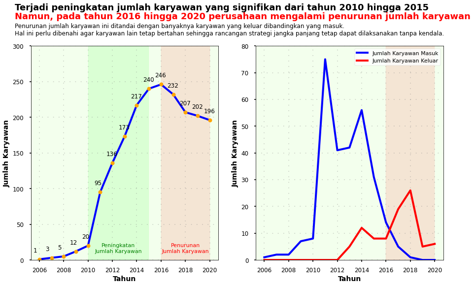
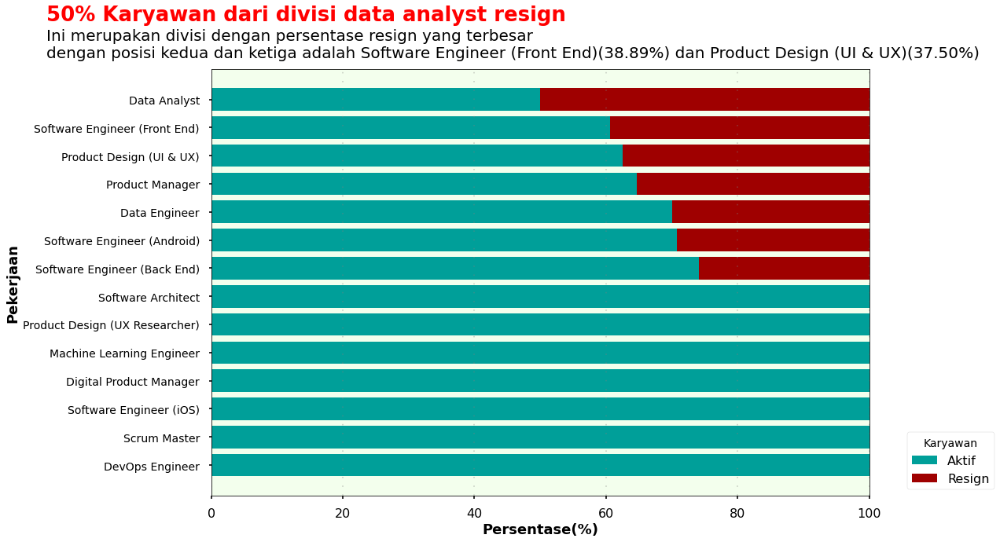
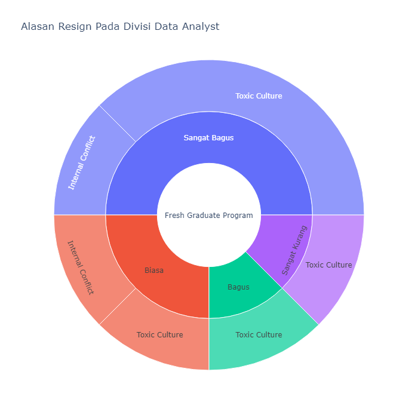
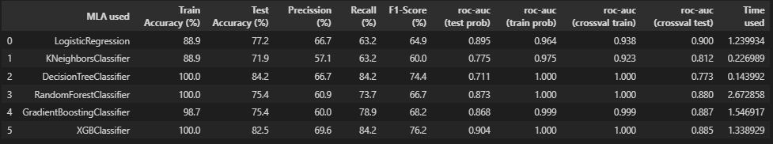
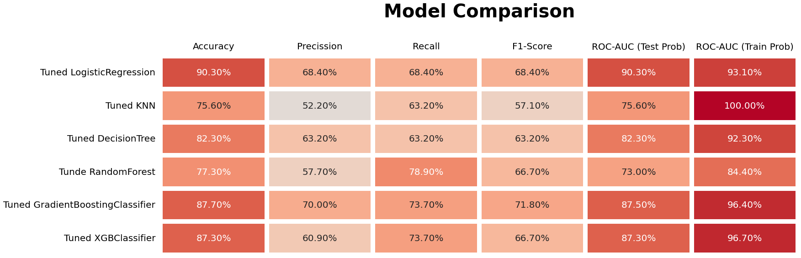
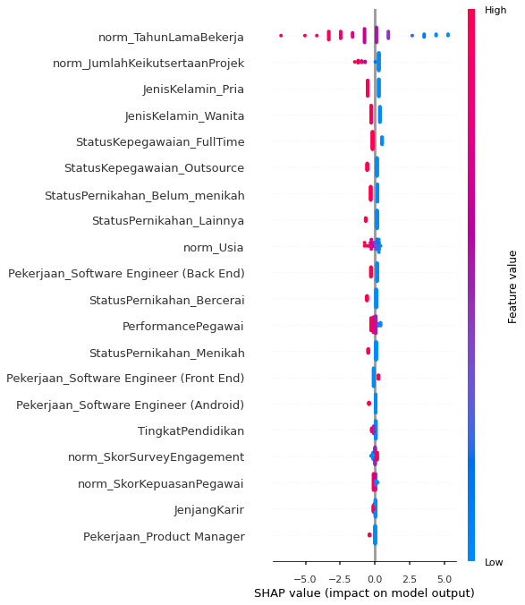
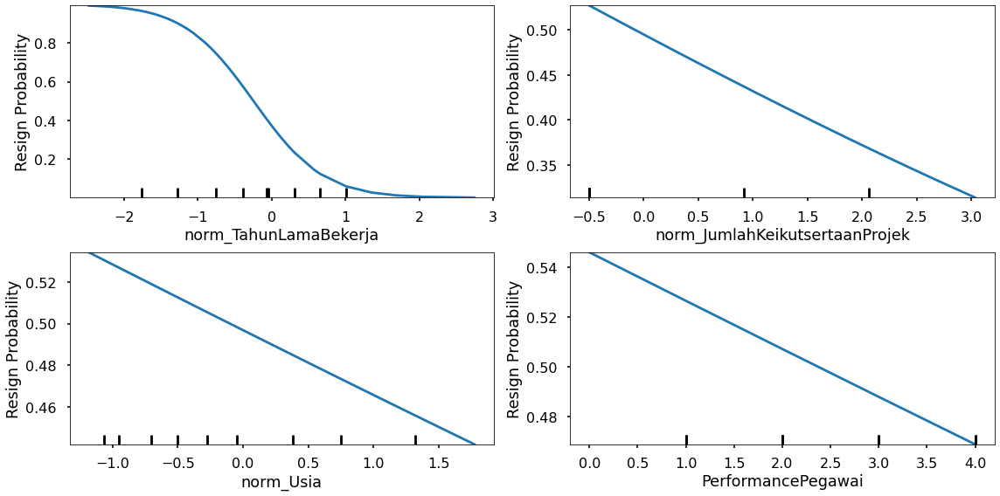

# Improving Employee Retention by Predicting Employee Attrition Using Machine Learning

## Background
Human resources (HR) are the main assets that need to be managed properly by a company so that business goals can be achieved effectively and efficiently. On this occasion, we will face a problem regarding human resources in the company. Our focus is to find out how to keep employees afloat in an existing company, which can result in increased costs for employee recruitment and training for those who have just entered. By knowing the main factors that cause employees to resign, companies can immediately overcome them by making programs that are relevant to employee problems.  

### Problem  
Many employees have resigned from the company (31%).    

### Goal  
* Reducing the rate of resignation from the company.   
* Increase the retention of employees.    

### Objective
* Create a machine learning model that can predict employees who resign.  
* Provide business recommendations based on the model that has been built.    

### Business Metric
Rate of resignation  

## Data
The data to be used is "Improving Employee Retention by Predicting Employee Attrition Using Machine Learning.xlsx - hr_data.csv." The data has 25 columns; the following is the variable information used:  

|Coloumn | Description |
|--------|-------------|
|Username |: Employee's username |                        
|EnterpriseID|: Unique identifier for each employee  |                         
|StatusPernikahan|: Employee marital status  |                       
|JenisKelamin|: The gender of the employee |                           
|StatusKepegawaian |: Employment status of employees |                   
|Pekerjaan|: The type of work (position) performed by an employee  |                            
|JenjangKarir |:  Employee career path   |                        
|PerformancePegawai|:  Values of Employee Performance   |                   
|AsalDaerah |:  Employee origin  |                          
|HiringPlatform |: a website where employees can find job information  |                      
|SkorSurveyEngagement|: Employee engagement score  |                  
|SkorKepuasanPegawai|: Employee satisfaction score |                 
|JumlahKeikutsertaanProjek|:  Number of employee participation in the project   |           
|JumlahKeterlambatanSebulanTerakhir |: Last month's number of tardiness of employees  | 
|JumlahKetidakhadiran|: Number of absent employees |               
|NomorHP |: Employee mobile number |                             
|Email|: Employee email  |                                
|TingkatPendidikan|:  Level of education of employee   |                    
|PernahBekerja|: Information on whether the employee has ever worked or not  |                        
|IkutProgramLOP|: Information on whether to join the LOP program |                      
|AlasanResign|: Reasons for Resigning from employees |                         
|TanggalLahir |: Employee's date of birth (Year-month-date)  |                        
|TanggalHiring|: Hiring date  |                        
|TanggalPenilaianKaryawan |: Employee Appraisal Date  |            
|TanggalResign |: Employee resignation date  |  

## Steps  
Some of the steps taken in this project are as follows:    
* Business Understanding : Define problems, goal, objective, and business metrics  
* Exploring Data & Data Preprocessing : Check missing value, check outliers, drop kolom, change data type and handle it.
* Insight : Provide insight based on number of resign employee, reason resign and analysis the division which has the most resign employees.
* Modeling : Define target, feature extraction, feature transformation (encoding & scaling), and feature selection, oversampling tuning hyperparameter and feature importance.
* Business Recomendations : Provide business recommendations from the modeling results.  

## Insights  
Here are some insights related to employee resignation: 

* Annual Report on Employee Number Changes  
  
There was a significant increase in the number of employees from 2010 to 2015. However, from 2016 to 2020, the company experienced a decrease in the number of employees. The decrease in the number of employees was marked by the number of employees leaving compared to those entering. This needs to be addressed so that other employees can survive and long-term strategic plans can still be implemented without problems.   

* Resign Reason Analysis for Employee Attrition Management Strategy  
  
From the picture above, it is clear that data analysts are the division with the highest percentage of employees, namely 50%. As a result, an investigation into the reasons why employees leave this division will be conducted.  

  
From the information above, it is found that the data analyst division is the division with the highest percentage of resignations, of which 50% are fresh graduates. Three out of eight fresh graduates resigned for reasons of toxic_culter and internal_conflict and it's very unfortunate that these three people are employees with very good performance. This needs to be a lesson for the company's self-improvement so that something like this does not happen again.  
The thing that must be done by the company is to improve the internals of the company so that employees remain comfortable while working. As a result, businesses can engage in a variety of activities that foster a sense of kinship (internally). Moreover, many of the resigning employees are fresh graduates who feel that the environment is toxic and that there are also internal problems.  

## Results
In doing the modeling, we do hyperparameter tuning. This is done because the resulting model is overfitting. The model results before hyperparameter tuning are as follows:  
  
From the several algorithms used, it is found that the Logistic Regression algorithm has good performance compared to other algorithms. However, from the ROC-AUC train test, it can be seen that all models are overfitted, so hyperparameters will be used to overcome overfitting.  
Following are the results of the model evaluation after hyperparameter tuning.  
  
From the results of several hyperparameter tunings, the model chosen is a model with a logistic regression algorithm because it has good performance compared to other models. It can be seen that the difference between the AUC train and test is not far, so this model is not overfitting or underfitting while the other models are still overfitting. Apart from that, evaluation metrics such as accuracy, precision, recall, and f1-score also have better values than the other models (can be seen as follows).  

AUC Score Train proba: 0.931  
AUC Score Test proba: 0.903   
Train Accuracy Score : 0.872  
Test Accuracy Score : 0.789  
Precision Score Test: 0.684  
Recall Score Test : 0.684  
F1 Score Test : 0.684   

From the model that has been built, some important features have been obtained, which are shown as follows:  
   
Then a further analysis is carried out using partial dependence to see the opportunities for employees to resign based on years of service, number of project participants, age, and performance of employees, as indicated by the following:   
    
From the importance of features and  partial dependence, it can be seen that:  
* The TahunLamaBekerja feature is the most important feature. From this, it can be seen that there is a tendency where employees who resign are employees who have worked for a long time with little value, which means that employees who tend to resign are employees who work for a short time.  
* Number of JumlahKeikutsertaanProjek is the second important feature where employees who tend to resign are employees who have never participated in a project.  
* Young employees have a high chance of resigning compared to old age.  
* Employees who have low performance have a higher chance of resigning compared to employees who have high performance.   

## Business Recommendation  
As is well known, employees who tend to resign are those who have worked for a short time and have never participated in a project. Therefore, what companies can do to prevent employees from resigning is to make employees feel at home working with the company. For this reason, companies can do the following:  

* Improve internally, as it is known that 50% of those who resign in the data analyst division have reasons related to internal, by carrying out activities that can strengthen the company's internal (employees with the company).    
* Give appreciation in the form of loyalty on a regular basis to employees who have been working for a long time (> 10 years).  
* Provide projects to employees evenly (at least once) so that all employees can feel they have contributed to the project.  
* Evaluate the work system that is implemented so that employees are comfortable at work.  
* Companies should focus on retaining young employees because they are more likely to resign than older employees.   

By implementing the above actions, it is possible that the rate of employee resignation can be reduced.  

