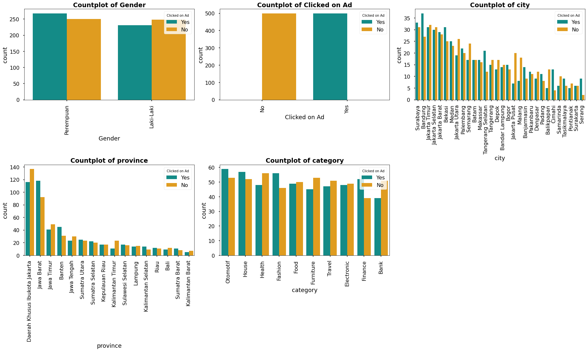

# Predict Customer Clicked Ads Classification by Using Machine Learning

## Background
A company in Indonesia wants to know the effectiveness of an advertisement that they display. It is important for the company to be able to find out how much the advertisement has been marketed so that it can attract customers to see the advertisement.By processing historical advertisement data and finding insights and patterns that occur, it can help companies determine marketing targets. The focus of this case is to create a machine learning classification model that functions to determine the right target customers.  

## Problem
The business team wants to optimize their advertising methods on digital platforms in order to get potential users to click on a product so that the costs to be incurred are not too large.  

## Goal
Make target marketing effective by using machine learning so that it can increase the click-through rate (CTR) and reduce costs incurred.  

## Objective
Building supervised machine learning to classify the right customers for marketing targets  

## Business Metrics
* Click Through Rate (CTR)  
* Total Cost  

## Data
The data to be used is "Clicked Ads Dataset.csv." The data has nine features with one target; the following is the variable information used:  

Variable Information:

| Column   | Descriptioan |
|-----------|--------------|
|Daily Time Spent on Site| : Length of stay at a site (daily) in minutes|
|Age | : User's age in years|
|Area Income |: User income in rupiah units|
|Daily Internet Usage | : Daily internet usage in minutes|
|Male | : Gender user|
|Timestamp | : When a user visits a site|
|Clicked on Ad | : Clicking on ads or not|
|city | : City of origin of the user|
|province | : Province of origin of the user| 

## Steps
Some of the steps taken in this project are as follows:    
* Business Understanding : Define problems, goal, objective, and business metrics
* Exploratory Data Analysis  : Descriptive statistics, univariate analysis, bivariate analysis, and mutlivariate analysis  
* Data Preprocessing  : Handle missing values, feature extraction, Hanlde outliers, feature selection and feature transformation  
* Modeling : There are two schemes that are carried out, namely modeling without scaling features and modeling with scaling features  
* Business Recomendation and Business Simulation : Provide business recommendations from the modeling results and provide an overview (simulation) of the benefits or advantages of using the modeling results  

## Exploratory Data Analysis   
    
From the results of exploratory data analysis using barplots it is found that:  
* More women click on advertisements than men. On the other hand, more men do not click on ads than do click on ads. But overall, there is no significant difference.    
* For the other columns, there are no values that are too dominant, and no conclusions can be drawn.  

  
According to the graph above, customers who click on ads spend an average of 40 to 50 minutes per day on the site. while those who did not click on ads were in the range of 75 to 85 minutes.    
* The age distribution of customers who click on ads resembles a normal distribution, with the majority of customers being between the ages of 35 and 45. Whereas those who did not click on ads had a skewed distribution, with the most customers being in the age range of 28–32 years.  
* The income area for customers who click on ads has a distribution resembling a normal distribution, with the majority of customers having an income area of IDR 300 million to IDR 400 million. Whereas those who do not click on ads have a skewed distribution, with the most customers having an income of around IDR 430 million - IDR 480 million.      
* Daily internet usage for customers who click on ads tends to be lower, with most customers having daily internet usage of 120 -140 minutes. Meanwhile, customers who do not click on ads tend to have large daily usage, with the most customers in the range of 220 to 240 minutes.  

       
From the pairplot above, it is found that:   
* The greater the customer's age, the lower the daily internet usage value as well as the daily time spent on site (inversely proportional).  
* It was also found that the tendency of customers to click on advertisements consisted of people of various ages who had daily internet usage and also spent daily time on sites that were small.  
* For daily time spent on site and daily internal usage, there is a positive correlation where the greater the daily time spent on site, the greater the daily internet usage.    

     
From the heatmap correlation above, it is known that the feature that has the highest correlation is between the daily time spent on site and daily internet usage, which is equal to 0.52. This number is not too large, so it does not indicate that there are redundant features, and all features can be used for machine learning. In addition, negative correlation values were also found, namely for age and daily internet usage, age with income area, and age with daily time spent on site. However, the correlation value is not large and does not exceed 0.7.  

The heatmap correlation (Pearson correlation) only shows the correlation of numerical features. Meanwhile, the correlation value of the category features is not known. For that, we can use PPS (Predictive Power Score), which can see the relationship of all features with the target ("Clicked on Ad").  
  
PPS (Predictive Power Score) found that the features `Daily Internet Usage`, `Daily Time Spent on Site`, `Age`, and `Area Income` have a high score compared to other features.  

## Data Preprocessing
In this step, handle missing values, feature extraction, handle outliers, feature selection and feature transformation as well as determining targets to be used in modeling.    
### Handle missing value  
For missing value handles in the four columns, it will be carried out based on the value of skewness and the highest value:  
* The `Daily Time Spent on Site` column will be filled with average values due to skew symmetry   
* The `Area Income` column will be filled with the median due to skew  
* The `Daily Internet Usage` column will be filled with an average due to the symmetry skew  
* The `Gender` field will be filled with the mode  
### Extract Date Time Data
At this stage, we created a new column based on the `Timestamp` column. The columns to create are the `month`, `days`, and `Weekdays` columns, where 0 denotes Monday and 6 denotes a week. Furthermore, it will be grouped into weekdays and weekends (Saturday and Sunday).  
###  Handling Outliers
As it is known that in the column 'Area Income' there are outliers, we will handle this by removing the outliers.  
  
We will be used the IQR method. Because the data is cleaner than outliers and not much data is removed (only 0.3% removed).  
  
### Feature Selection
Pada tahap ini dilakukan drop kolom yang tidak berhubungan dengan model yang akan dibangun.  
### Feature Encoding
The feature encoding technique used is one hot encoding because all categorical variables are not ordinal or multilevel variables.     

## Modeling
Before doing modeling, a split-tran test data set is first performed. Then two schemes are carried out, namely modeling without feature scaling and modeling with feature scaling. Following are the results of the two schemes:  
* Without feature scaling  
  
* With feature scaling  
    

After the feature transformation process was carried out using normalization on several numerical features and transformation into the cosine value of cyclic data, it was found that the model performance of various algorithms had increased. which has experienced a drastic increase is the logistic regression algorithm, which has a precision of 100%, a recall of 97.2%, and an F1-Score of 98.6%, as well as a model that has a good evaluation matrix value and a short computation time. However, the cross validation value of the ROC-AUC model is the lowest compared to the other models.  

The model's goal is to predict the maximum number of potential customers who will click on an ad. Therefore we must minimize False Positives where customers who do not click on ads are predicted to click on ads wrongly. This will lead to retargeting the wrong market and then cause potential losses because we have spent marketing costs on the wrong target.  

Therefore, we have to optimize the precision score while still considering other metrics to be at their maximum.  
Finally, the model chosen is the one with the Random Forest algorithm because it has a greater precession and accuracy value than the other models. However, you can also use a model with the gradient boosting algorithm, which is not much different from the results of the Random Forest algorithm model.   

The following is the confusion matrix of the random forest algorithm model with a modeling scheme with feature scaling (transformation):  
    
From the confusion matrix, it can be seen that the model with the random forest algorithm has good performance, where the predicted number of clicks but no clicks (false positives) is of little value.    

From the model that has been built, the features that have a major influence on the model are obtained. The are 4 important features are `Daily Internet Usage`, `Daily Spent on Site`, `Area Income` and `Age` (picture below). These four features greatly affect the model that the customer will click on the ad or not. This important feature will be used as a benchmark for business recommendations.    
    

## Business Recommendations and Business Simulation  

### Business Recommendations  
Based on EDA and feature importance, business recommendations that can be submitted are as follows:    
* Customers who click on ads are customers who spend time on the internet and websites in a short time. Therefore, the thing that can be done is to optimize advertisements with more attractive packaging so that when a customer enters the website, they immediately click on the advertisement. On the other hand, adding advertisements is deemed unnecessary because it can increase costs and customers who click on advertisements do not spend much time on the internet.  
* Based on "Area Income", customers are normally distributed, which means that customers who click on ads are those with small to the largest income areas. The action that can be taken is to make sure that the advertisements given are advertisements that can cover all income groups so that both customers with low and high incomes are interested in clicking on the advertisements given.  
* Based on "Age", customers are normally distributed, which means that customers who click on ads range in age from young to old. The action that can be taken is to ensure that the advertisements given are those that can cover all age groups so that both young and old customers are interested in clicking on the advertisements given.   

### Business Simulation  
The data used in this business simulation is the data from the split_train_test (data test). In the data set there are 144 users who click on ads and 154 who do not click on ads (298 users/customers). There are two schemes in this business simulation, namely without machine learning and with machine learning. With the assumptions used are as follows:   
* Advertising costs per customer =  Rp. 1,000  
* Profit earned when a customer clicks on an ad = Rp. 5,000  

Without machine learning (advertising is applied to all 298 customers), it was found that the CTR was 48.32% with a total cost of Rp. 298,000, revenue of Rp. 720,000 and the profit earned is Rp. 422,000.  While with modeling (advertisements are only given to customers who are predicted by the model to click on ads, namely 142 people.) it was found that the CTR was 98.59% with a total cost of Rp. 142,000, revenue of Rp. 700,000 and the profit earned is Rp. 558,000.   

### Conclusions
The conclusions from the business simulation above are as follows:      
* By using machine learning CTR increased by 50.27%.      
* Cost efficiency of 52.35%, where in the business simulation it was found that the costs not incurred due to using the results from the model amounted to Rp.156,000.     
* The percentage of profit has increased by 32.32% or from business simulation it is found that the difference in profit using the results of the model and not using the model is Rp. 136,000.     
